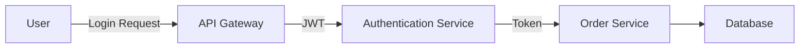
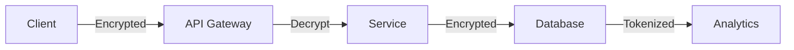

# **OWASP A04:2021 - Insecure Design in .NET Applications**
## **Comprehensive Guide to Secure Architecture and Design Patterns**

---

## **1. Introduction to Insecure Design**
**Definition:** Security flaws introduced at the architecture and design phase that cannot be fixed by proper implementation alone.

**Key Characteristics:**
- Fundamental architectural weaknesses
- Missing security controls in core design
- Business logic vulnerabilities
- Inadequate security boundaries

**Impact:** 
- Systemic security failures
- Bypass of security controls
- Data breaches
- Compliance violations

---

## **2. Missing Threat Modeling**

### **Problem:**
Security considerations absent from design phase

### **Solution: Implement STRIDE Threat Modeling**

#### **Step 1: Create Data Flow Diagrams**


#### **Step 2: Threat Analysis Table**
| **Component**       | **STRIDE Threat**       | **Mitigation**                          |
|----------------------|-------------------------|-----------------------------------------|
| Authentication Service | Spoofing               | MFA, Strong Password Policies           |
| API Gateway          | Tampering              | Request Validation, HMAC Signing        |
| Order Service        | Information Disclosure | Encryption, Proper Error Handling       |

#### **Step 3: Implement in .NET**
```csharp
// Secure design principle: Validate all inputs at boundary
public class OrderController : ControllerBase
{
    private readonly IThreatModelValidator _validator;
    
    public OrderController(IThreatModelValidator validator)
    {
        _validator = validator;
    }
    
    [HttpPost]
    public IActionResult CreateOrder(OrderDto order)
    {
        _validator.Validate(order); // Checks against threat model
        // ...
    }
}
```

---

## **3. Inadequate Authentication/Authorization Architecture**

### **Problem:**
Flat permission structures or improper separation

### **Solution: Hierarchical RBAC with ABAC**

#### **Secure Design Pattern**
```csharp
// Policy-based authorization
services.AddAuthorization(options =>
{
    options.AddPolicy("OrderApproval", policy => 
        policy.RequireRole("Manager")
              .RequireClaim("Department", "Finance")
              .Requirements.Add(new MinimumTenureRequirement(6)));
});

// Attribute-based check
[Authorize(Policy = "OrderApproval")]
public IActionResult ApproveOrder(int orderId) { ... }
```

#### **Advanced: Domain-Driven Security**
```csharp
public class OrderService
{
    private readonly ISecurityContext _securityContext;
    
    public void ApproveOrder(Order order)
    {
        if (!_securityContext.CurrentUser.CanApprove(order))
            throw new SecurityException("Approval violation");
        
        order.Approve();
    }
}
```

---

## **4. Business Logic Flaws**

### **Problem:**
Workflows that can be exploited through legitimate pathways

### **Solution: State Machine Pattern with Validation**

#### **Secure Implementation**
```csharp
public class OrderWorkflow
{
    private Order _order;
    
    public void Approve(User approver)
    {
        if (_order.Status != OrderStatus.PendingApproval)
            throw new WorkflowException("Invalid state transition");
        
        if (!approver.CanApprove(_order))
            throw new AuthorizationException();
            
        _order.Status = OrderStatus.Approved;
        _order.ApprovedBy = approver.Id;
        _order.ApprovalDate = DateTime.UtcNow;
    }
}
```

#### **Validation Rules**
```csharp
public class OrderValidator : AbstractValidator<Order>
{
    public OrderValidator()
    {
        RuleFor(o => o.Amount)
            .LessThan(o => o.Customer.CreditLimit)
            .WithMessage("Exceeds credit limit");
        
        RuleFor(o => o.Status)
            .Must(BeValidTransition)
            .WithMessage("Invalid status change");
    }
}
```

---

## **5. Improper Data Flow Design**

### **Problem:**
Sensitive data exposure through architectural paths

### **Solution: Secure Pipeline Pattern**

#### **Data Flow Architecture**


#### **Implementation**
```csharp
// Secure data pipeline
public class SecureDataPipeline
{
    private readonly IDataProtector _protector;
    
    public SecureDataPipeline(IDataProtectionProvider provider)
    {
        _protector = provider.CreateProtector("PII.v1");
    }
    
    public ProcessedData Process(SensitiveInput input)
    {
        var sanitized = new Sanitizer().Clean(input);
        var encrypted = _protector.Protect(sanitized.ToJson());
        return new Database().Store(encrypted);
    }
}
```

---

## **6. Lack of Security Controls in Workflows**

### **Problem:**
Critical operations without security checks

### **Solution: Decorator Pattern for Security**

#### **Implementation**
```csharp
public interface IOrderProcessor
{
    void Process(Order order);
}

public class OrderProcessor : IOrderProcessor { ... }

public class SecureOrderProcessor : IOrderProcessor
{
    private readonly IOrderProcessor _inner;
    private readonly ISecurityValidator _validator;
    
    public SecureOrderProcessor(IOrderProcessor inner, ISecurityValidator validator)
    {
        _inner = inner;
        _validator = validator;
    }
    
    public void Process(Order order)
    {
        _validator.Validate(order);
        _inner.Process(order);
        new Auditor().Log(order);
    }
}
```

---

## **7. Insecure Default Configurations**

### **Problem:**
Overly permissive defaults

### **Solution: Secure-by-Default Setup**

#### **ASP.NET Core Secure Defaults**
```csharp
public static IHostBuilder CreateHostBuilder(string[] args) =>
    Host.CreateDefaultBuilder(args)
        .ConfigureWebHostDefaults(webBuilder =>
        {
            webBuilder.UseStartup<Startup>()
                     .UseKestrel(options =>
                     {
                         options.ConfigureHttpsDefaults(https =>
                         {
                             https.SslProtocols = SslProtocols.Tls12 | SslProtocols.Tls13;
                         });
                     })
                     .ConfigureAppConfiguration(config =>
                     {
                         config.AddSecureDefaults(); // Custom extension
                     });
        });
```

#### **Secure Defaults Checklist**
- [ ] TLS 1.2+ enforced
- [ ] HTTP headers (HSTS, CSP)
- [ ] Minimal API surface exposed
- [ ] Sensitive logging disabled
- [ ] Default admin credentials rotated

---

## **8. Failure to Enforce Security Boundaries**

### **Problem:**
Trust relationships without verification

### **Solution: Zero Trust Architecture**

#### **Implementation**
```csharp
// Microservice communication
public class OrderServiceClient
{
    private readonly HttpClient _client;
    private readonly ISigner _signer;
    
    public async Task<Order> GetOrder(int id)
    {
        var request = new HttpRequestMessage(HttpMethod.Get, $"/orders/{id}");
        request.Headers.Add("X-Signature", _signer.SignRequest(request));
        
        var response = await _client.SendAsync(request);
        response.EnsureIdentityVerified(); // Extension method
        return await response.Content.ReadAsAsync<Order>();
    }
}
```

#### **Boundary Enforcement Techniques**
1. **Service-to-Service:** mTLS with SPIFFE IDs
2. **User-to-Service:** Continuous authentication
3. **Data:** Encryption at rest and in transit

---

## **Secure Design Checklist for .NET Architects**

1. **Threat Modeling**
   - [ ] Conducted during design phase
   - [ ] Updated with major changes

2. **Authentication/Authorization**
   - [ ] Role-based and attribute-based controls
   - [ ] Centralized policy management

3. **Business Logic**
   - [ ] State machine validation
   - [ ] Anti-fraud measures

4. **Data Flow**
   - [ ] Encryption in transit/at rest
   - [ ] Minimal data exposure

5. **Workflows**
   - [ ] Security controls at each step
   - [ ] Audit trails

6. **Configuration**
   - [ ] Secure defaults
   - [ ] Environment-specific hardening

7. **Boundaries**
   - [ ] Zero-trust principles
   - [ ] Service isolation

---

## **Tools for Secure Design**

| **Purpose**               | **Tool**                          |
|---------------------------|-----------------------------------|
| Threat Modeling           | Microsoft Threat Modeling Tool    |
| Architecture Analysis     | OWASP Secure Architecture Review  |
| Policy Management         | Azure Policy, HashiCorp Sentinel  |
| Secrets Management        | Azure Key Vault, AWS Secrets Manager |
| Configuration Validation  | Chef InSpec, Terraform Sentinel   |

---

This guide provides actionable patterns to address OWASP A04 vulnerabilities at the design level. Implementation should be complemented with:
- Regular architecture reviews
- Secure design training
- Automated policy enforcement
- Red team exercises
