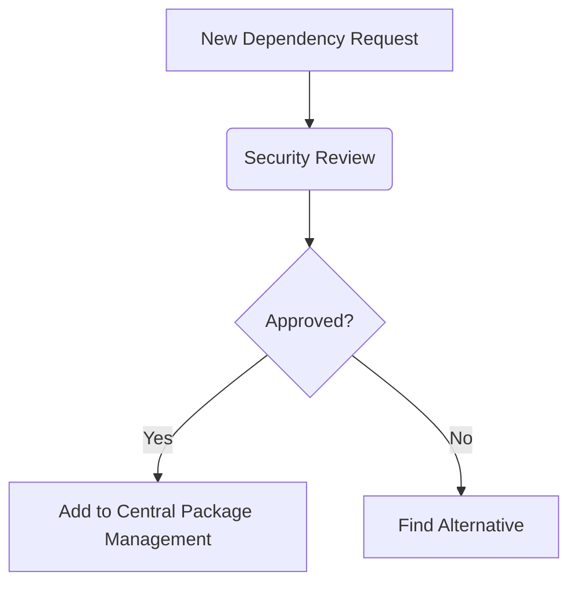

# **Comprehensive Guide to Managing Vulnerable and Outdated Components in .NET (OWASP A06:2021)**

This guide provides a thorough approach to addressing component risks in .NET applications, covering detection, mitigation, and prevention strategies for vulnerable dependencies.

---

## **1. Unpatched NuGet Dependencies**

### **Problem:** Using packages with known vulnerabilities

### **Detection Methods**
1. **CLI Scanning**
```bash
dotnet list package --vulnerable --include-transitive
```

2. **Programmatic Check**
```csharp
// Add to build pipeline
public void CheckVulnerabilities()
{
    var process = new Process
    {
        StartInfo = new ProcessStartInfo
        {
            FileName = "dotnet",
            Arguments = "list package --vulnerable",
            RedirectStandardOutput = true
        }
    };
    process.Start();
    string output = process.StandardOutput.ReadToEnd();
    if (output.Contains("vulnerable"))
        throw new Exception("Vulnerable packages detected");
}
```

### **Mitigation Strategies**
- **Immediate Action:** 
  ```bash
  dotnet add package Newtonsoft.Json --version 13.0.3
  ```
- **Long-term Solution:**
  ```xml
  <!-- Directory.Packages.props -->
  <PackageVersion Include="Newtonsoft.Json" Version="13.0.3" />
  ```

---

## **2. Outdated .NET Runtime**

### **Problem:** Running on unsupported versions

### **Detection**
```bash
dotnet --list-runtimes
# Compare with https://dotnet.microsoft.com/en-us/platform/support/policy
```

### **Upgrade Process**
1. **In-Place Upgrade**
```xml
<!-- Project file -->
<TargetFramework>net8.0</TargetFramework>
```

2. **Runtime Validation Middleware**
```csharp
app.Use(async (context, next) =>
{
    var runtimeVersion = System.Runtime.InteropServices.RuntimeInformation.FrameworkDescription;
    if (!runtimeVersion.Contains(".NET 8"))
    {
        context.Response.StatusCode = 503;
        await context.Response.WriteAsync("Unsupported runtime");
        return;
    }
    await next();
});
```

---

## **3. Vulnerable System Libraries**

### **Problem:** OS-level dependencies with vulnerabilities

### **Detection (Docker Example)**
```dockerfile
FROM mcr.microsoft.com/dotnet/aspnet:8.0 AS base
RUN apt-get update && apt-get install -y \
    openssl \
    && rm -rf /var/lib/apt/lists/*

# Scan with:
docker scan <your-image>
```

### **Mitigation**
```dockerfile
# Use distroless base image
FROM gcr.io/distroless/dotnet:8.0 AS base
```

---

## **4. Unmaintained Third-Party Components**

### **Problem:** Abandoned dependencies

### **Evaluation Checklist**
1. **Activity Metrics**
   - Last update > 1 year?
   - Open issue count?
   - Security advisories?

2. **Replacement Strategy**
```bash
# Remove deprecated package
dotnet remove package OAuth.Core

# Add maintained alternative
dotnet add package Microsoft.Identity.Web
```

---

## **5. Inherited Framework Vulnerabilities**

### **Problem:** Base framework security issues

### **Detection**
```bash
# Check framework dependencies
dotnet list package --include-transitive
```

### **Mitigation**
```xml
<!-- Override vulnerable transitive dependency -->
<PackageReference Include="System.Text.Encodings.Web" Version="8.0.0" />
```

---

## **6. Transitive Dependency Risks**

### **Problem:** Indirect vulnerable dependencies

### **Solution: Central Package Management**
```xml
<!-- Directory.Packages.props -->
<ItemGroup>
  <PackageVersion Include="System.Text.Json" Version="8.0.0" />
  <PackageVersion Include="Microsoft.Extensions.Logging" Version="8.0.0" />
</ItemGroup>
```

### **Build Enforcement**
```xml
<!-- Directory.Build.props -->
<PropertyGroup>
  <RestorePackagesWithLockFile>true</RestorePackagesWithLockFile>
  <DisableImplicitNuGetFallbackFolder>true</DisableImplicitNuGetFallbackFolder>
</PropertyGroup>
```

---

## **7. Build Toolchain Vulnerabilities**

### **Problem:** Compromise through build tools

### **Secure CI/CD Pipeline**
```yaml
# GitHub Actions Example
jobs:
  build:
    runs-on: ubuntu-latest
    steps:
    - uses: actions/checkout@v4
    - name: Setup .NET
      uses: actions/setup-dotnet@v3
      with:
        dotnet-version: 8.0.x
        
    - name: Audit packages
      run: dotnet list package --vulnerable
      
    - name: Build
      run: dotnet build --configuration Release --no-restore
```

---

## **Comprehensive Component Management Strategy**

### **1. Prevention**


### **2. Monitoring**
| **Tool**               | **Usage**                              |
|------------------------|----------------------------------------|
| GitHub Dependabot      | Automated PRs for updates              |
| OWASP Dependency-Check | Deep dependency scanning               |
| NuGet Audit            | Built-in .NET 8+ vulnerability checks  |

### **3. Response Plan**
1. **Critical CVEs:** Patch within 24 hours
2. **High CVEs:** Patch within 7 days
3. **Medium/Low:** Include in next sprint

---

## **Enterprise-Grade Recommendations**

1. **Artifact Management**
   - Azure Artifacts with vulnerability scanning
   - Private NuGet feeds with approval workflows

2. **Policy Enforcement**
```powershell
# Pre-commit hook
if (dotnet list package --vulnerable | Select-String "High") {
    Write-Error "Vulnerable packages detected"
    exit 1
}
```

3. **Runtime Protection**
```csharp
// Startup validation
public static void Main(string[] args)
{
    ValidateDependencies();
    CreateHostBuilder(args).Build().Run();
}

private static void ValidateDependencies()
{
    var badPackages = new[] { "Microsoft.AspNet.Mvc", "EntityFramework" };
    foreach (var package in badPackages)
    {
        if (AppDomain.CurrentDomain.GetAssemblies()
            .Any(a => a.FullName.Contains(package)))
        {
            throw new Exception($"Banned package detected: {package}");
        }
    }
}
```

---

## **Component Security Checklist**

✅ **Pre-Development**
- [ ] Maintained component selection criteria
- [ ] Approved packages list

✅ **Development**
- [ ] Central package management
- [ ] Transitive dependency control

✅ **CI/CD**
- [ ] Automated vulnerability scanning
- [ ] Build-time validation

✅ **Production**
- [ ] Runtime dependency checks
- [ ] Emergency update process

This comprehensive approach addresses OWASP A06 through proactive management of .NET components throughout the application lifecycle. Implement these practices to significantly reduce risk from vulnerable dependencies.
